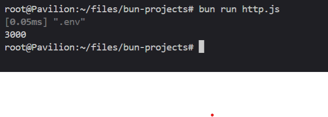

# bun-scripts


## Installation

```bash 
$ curl https://bun.sh/install | bash
```
after this i opened my .bashrc and added the following line:
```bash
BUN_INSTALL="/root/.bun"
PATH="$BUN_INSTALL/bin:$PATH"
# as it wasn't added automatically, i added it manually
```
i restarted my terminal and it worked! 🎉


## working with [.env](./.env) and bun
```bash
# then i did a fancy stuff
echo PORT=5000 >> .env
touch http.js
```

```JavaScript
// http.js
console.log(process.env.PORT)
// USING ENVIRONMENT VARIABLES WITHOUT DOTENV MODULES.
```

```bash
bun run http.js
```


---
sugggest me what should i try next with [bun](https://bun.sh)

**🤝🏾Connect me on:**
**Twitter**: 🕊️[`@Abhayprajapati_`](https://twitter.com/Abhayprajapati_)
**Github**: 🐧[`@theabhayprajapati`](https://github.com/theabhayprajapati)